# Component Intelligence — User Guide

**Advantech · Part Insight Platform**
Data via the **SiliconExpert ProductAPI** · Built on the Advantech MPN ↔ SE_ComID mapping.

This guide walks through every feature of the site using live components from your **Recent Searches** — primarily **REF195FSZ** (`1410026459-01`), **BQ25570RGRT** (`1410026603-01`), **TPS71701DCKR** (`1410026580-01`) and **TPS630250RNCT** (`1410026581-01`) — so every screenshot below is real SiliconExpert data, not a mock.

---

## Table of contents

1. [Home — Search](#1-home--search)
2. [Results list](#2-results-list)
3. [Detail page (8 tabs)](#3-detail-page)
   1. [Overview](#31-overview)
   2. [Lifecycle & Risk](#32-lifecycle--risk)
   3. [Cross Reference](#33-cross-reference)
   4. [Pricing & Stock](#34-pricing--stock)
   5. [Compliance](#35-compliance)
   6. [Documents](#36-documents)
   7. [Packaging Data](#37-packaging-data)
   8. [Countries of Origin](#38-countries-of-origin)
4. [Action screens](#4-action-screens)
   1. [Download — PDF report](#41-download--pdf-report)
   2. [Export — JSON payload](#42-export--json-payload)
   3. [Watch — PCN & lifecycle alerts](#43-watch--pcn--lifecycle-alerts)
   4. [Compare — side-by-side, up to 5](#44-compare--side-by-side-up-to-5)
5. [Tips, troubleshooting, quotas](#5-tips-troubleshooting-quotas)

---

## 1. Home — Search

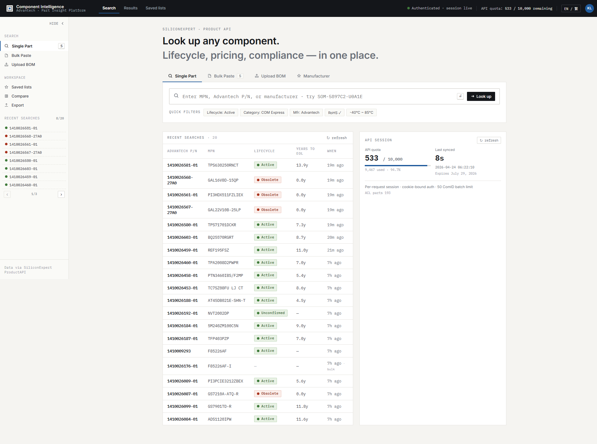

The Home screen is built around three search modes and a live workspace sidebar.

### 1.1 Search modes (main panel)

| Mode | When to use |
|---|---|
| **Single Part** | Look up one MPN or Advantech P/N. Press `S` anywhere to focus the search box. |
| **Bulk Paste** | Paste 1–50 part numbers, one per line. The API accepts up to 50 ComIDs per batch (`/partDetail`). |
| **Upload BOM** | Drag-drop a `.csv`, `.xlsx`, or `.txt` BOM. The first column is parsed as MPNs. |
| **Manufacturer** | Live autocomplete against `/manufacturers` — type a brand (e.g. `analog`) to land on that manufacturer's profile. |

Below the search box you get **Quick Filters** (`Lifecycle: Active`, `Mfr: Advantech`, `-40°C ~ 85°C`, etc.) which pre-populate search constraints.

### 1.2 Recent searches (home panel & sidebar)

- **Home panel** (right side of the page): full table of the last 20 lookups with Advantech P/N, MPN, lifecycle pill, years to EOL, and relative "when" — clickable rows jump straight to the detail page. Click **↻ refresh** to re-query `/api/recent`.
- **Sidebar** (left side, always visible): 8 entries per page with `‹ / ›` pagination, covering up to 20 most-recent parts. Colored dot reflects lifecycle status (green = Active, amber = NRND, red = Obsolete).

> **Under the hood:** recent searches are persisted in the SQLite-backed `/api/recent` endpoint. Both the panel and sidebar share one cache keyed to fetch 20 rows, so they never diverge.

### 1.3 API session panel

Bottom-right on the home page: shows your SiliconExpert session (quota remaining, last-synced timestamp, expiration date). At 94.7% used, you have 533 of 10,000 quota remaining in this session.

---

## 2. Results list

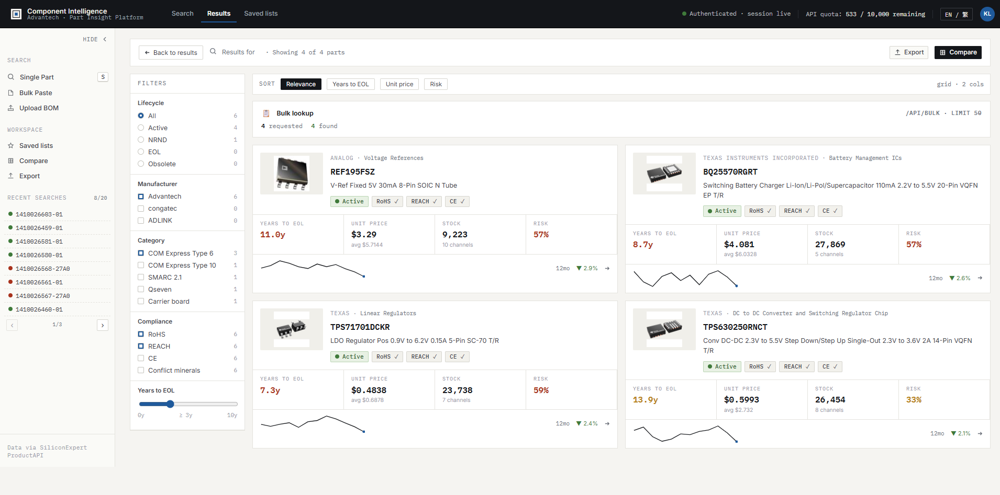

When you click **Look up** on Single Part, Bulk Paste, or Upload BOM, you land on the Results list.

### 2.1 Loading progress (no more mock cards)

Before real data arrives, the page shows a live progress indicator:

- **Search phase** — "Searching SiliconExpert…" (indeterminate shimmer bar).
- **Details phase** — "Downloading part details · N / M" with a percentage fill. For bulk paste this gives you the exact download count.

Four skeleton cards mirror the final grid layout so the transition has zero layout shift. The previous mock-cards fallback has been removed.

### 2.2 Cards

Each result card shows the MPN, manufacturer, category, datasheet thumbnail, description, lifecycle pill, compliance pills, and a four-column strip:

- **Years to EOL** · **Unit price** (or Resilience) · **Stock** (or Sources) · **Risk %**

A 12-month unit-price sparkline with the direction indicator sits at the bottom.

### 2.3 Filters, sort, and bulk banner

- **Filters (left)** — Lifecycle / Manufacturer / Category / Compliance / Years-to-EOL slider.
- **Sort bar (top)** — Relevance / Years to EOL / Unit price / Risk.
- **Bulk banner** — appears when you arrive via Bulk Paste: requested / found / not-found counters and a truncation warning if > 50 parts were submitted.

### 2.4 Actions on the Results list

Two buttons in the top-right:

- **Export** — opens the [Export · JSON](#42-export--json-payload) screen pre-loaded with the filtered list.
- **Compare** — opens the [Compare](#44-compare--side-by-side-up-to-5) screen with the filtered list as pickable columns.

Per-component actions (**Download PDF**, **Watch**) live on the Detail page — see §4.

---

## 3. Detail page

Click any card or any recent-searches row to open the detail page. The header shows the datasheet thumbnail, manufacturer · category tags, lifecycle pills, MPN as the H1, Advantech P/N / ComID / family metadata, and a 2×2 stats strip (**Unit Price · Stock · Years to EOL · Risk**).

On the right, four action buttons: **Download**, **Export**, **Watch**, **Compare** — each deep-links to the matching action screen pre-selected for the current part.

### 3.1 Overview

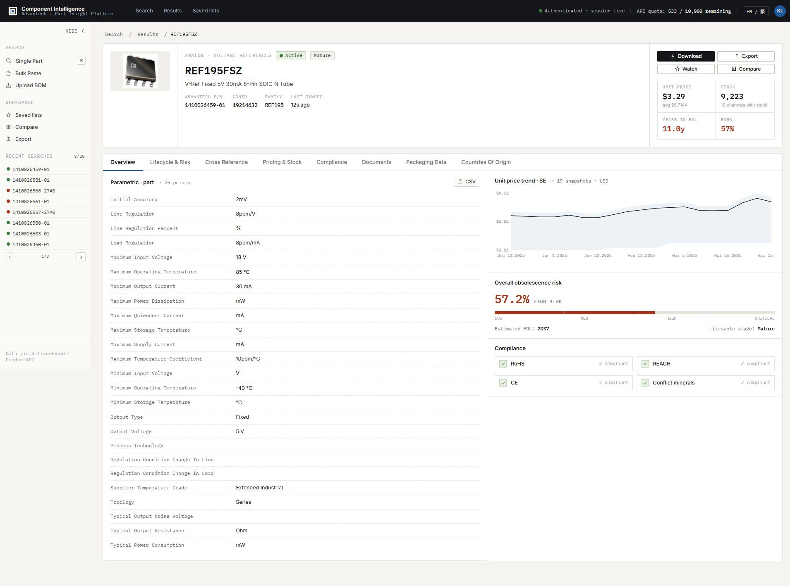

- **Parametric table** (left): every SE-published parameter the part exposes — e.g. REF195FSZ shows 25 specs: Initial Accuracy, Line Regulation, Max Input Voltage, Output Voltage, Temperature grade, etc. Tap **CSV** to download just this table.
- **Unit price trend · SE** (right): 12-month price history with configurable range band, pulled from SE `PricingData`.
- **Overall obsolescence risk**: 0–100% risk bar with color-coded Low / Med / High / Critical zones, plus estimated EOL year and lifecycle stage.
- **Compliance pills**: RoHS / REACH / CE / Conflict minerals compliance.

### 3.2 Lifecycle & Risk

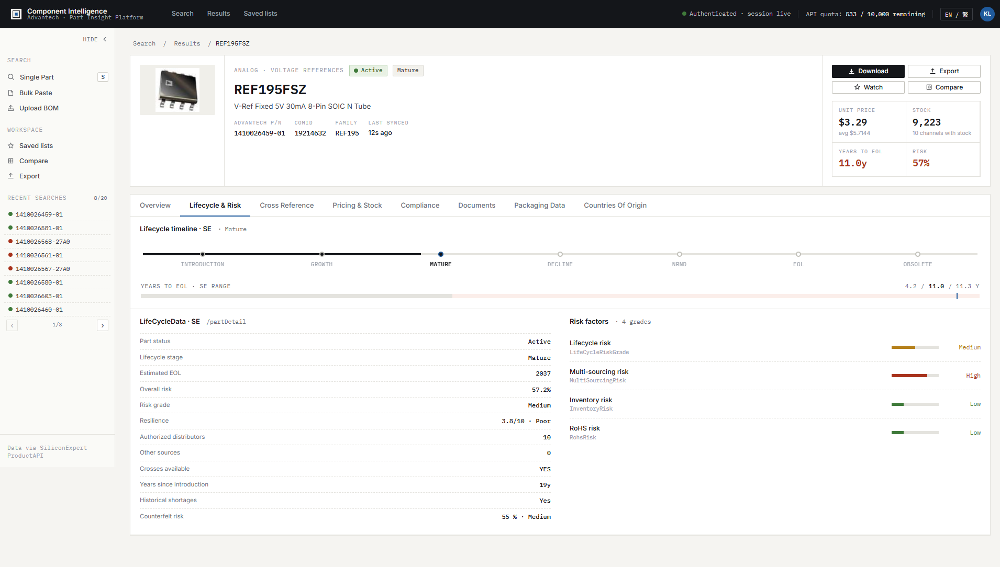

Deep-dives into the `/partDetail → Lifecycle` and SE risk model:

- Risk factor decomposition (Supply / Demand / …).
- Lifecycle stage, part status, estimated EOL, years-to-EOL min/max/expected.
- Lifecycle history: every SE-tracked status change with source URL.

### 3.3 Cross Reference

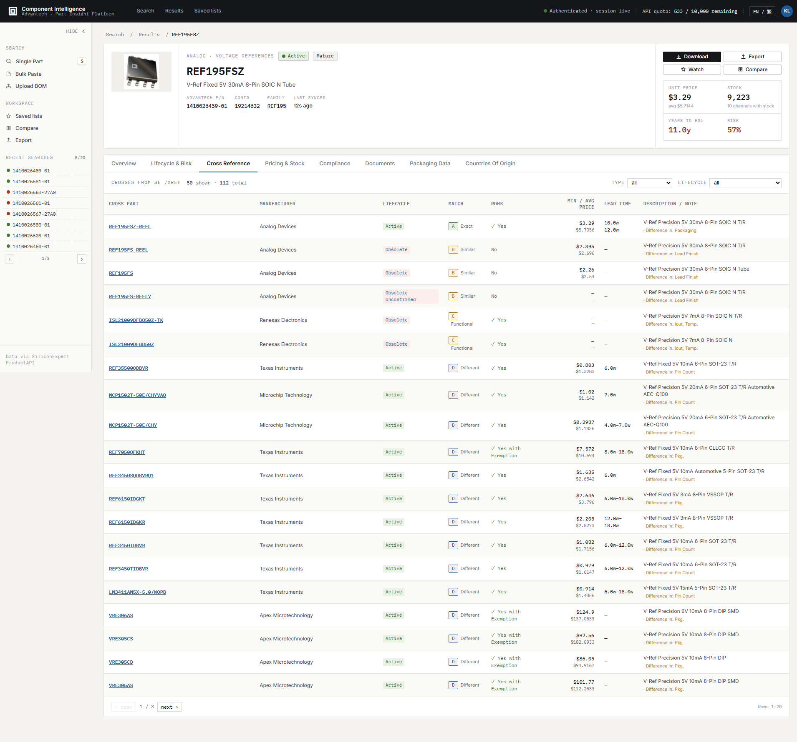

Shows crosses / alternates from `/xref`:

- Cross-match confidence grade.
- Pin-compatible vs Form-fit-function vs functional alternates.
- For each alternate: MPN, manufacturer, availability, ComID link.

### 3.4 Pricing & Stock

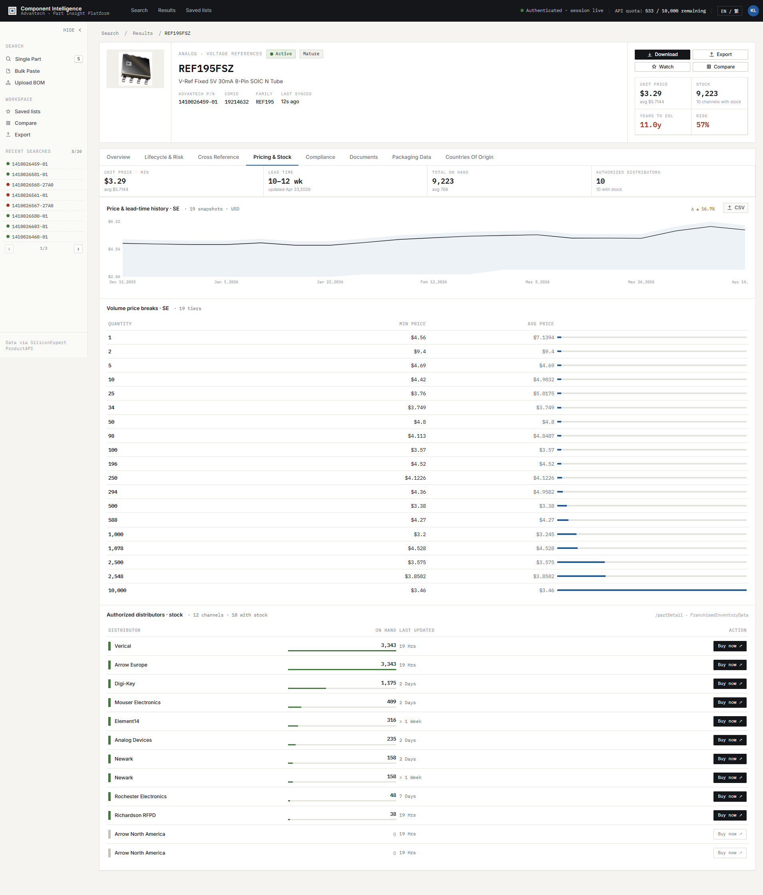

- **Distributor rows** — every channel with stock: distributor name, region, currency, on-hand qty, lead time, MOQ, min/avg/max unit price, extended price.
- **Price trend** — same sparkline as the Overview but with full axes and snapshot count.
- **Inventory waterfall** — sum across distributors, plus per-distributor breakdown.

### 3.5 Compliance

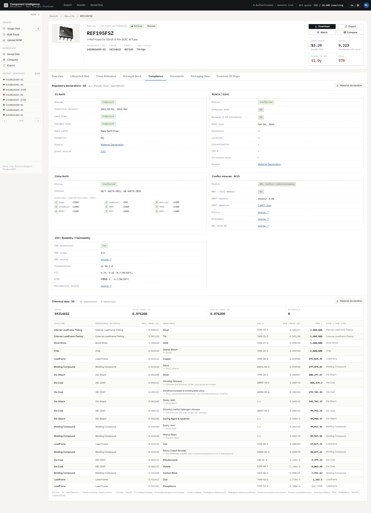

- RoHS (with exemption details), REACH (SVHC list), CE, Conflict minerals, Halogen-free, etc.
- Materials declaration link and MRT/CMRT download when SE has them.
- Each status comes with a source URL so you can trace the evidence.

### 3.6 Documents

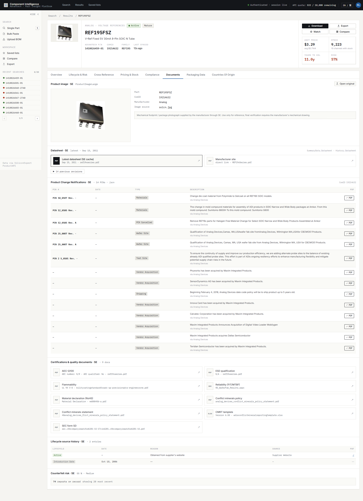

- **Datasheet history** — every revision SE has indexed (for REF195FSZ: 14 revisions from 1996 to 2011) with download URLs.
- **Certifications** — AEC-Q100, ESD qualification, flammability, reliability (FIT/MTBF), material declaration (RoHS), conflict minerals policy, CMRT template, SEC form SD.
- **GIDEP / counterfeit reports** — list of known counterfeit incidents affecting this manufacturer, with notification dates and source links (e.g. REF195FSZ is linked to 74 counterfeit reports across Analog Devices parts, overall Medium risk).

### 3.7 Packaging Data

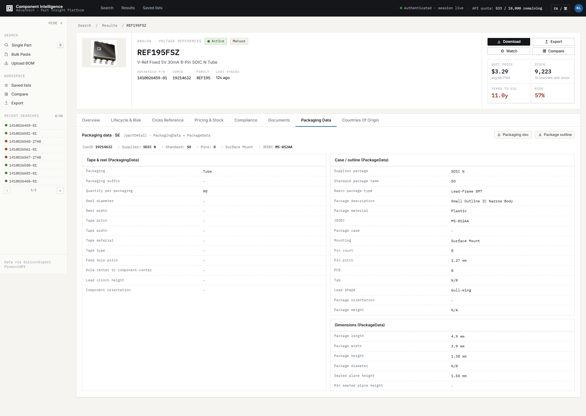

Two sections side-by-side:

- **Tape & reel / Tube** — packaging type, quantity per unit, reel diameter, tape pitch, feed-hole pitch, component orientation.
- **Case / outline** — supplier package code, standard package name, JEDEC code, package dimensions (length × width × height), mounting type, pin count, lead shape.
- **Dimensions** — length / width / height / diameter / seated plane height.

The old `Fields: …` debug footer has been removed.

### 3.8 Countries of Origin

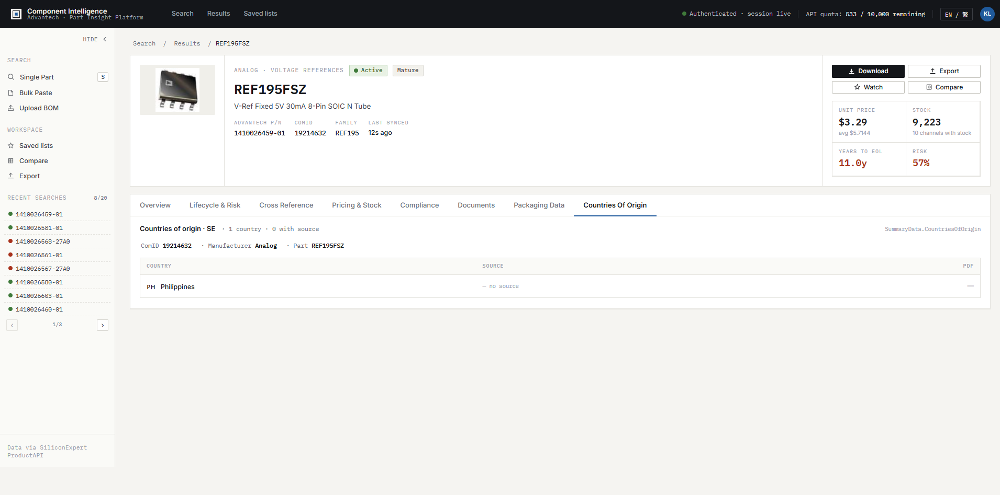

Every manufacturing country SE has on file, sorted by provenance (ones with a source URL first, then alphabetical). Each row: ComID, Country, Source PDF link.

---

## 4. Action screens

All four screens share one design language — a compact header with a back button, title, summary line, and a primary action in the top-right. The body is a multi-column layout: **selection on the left**, **configuration** in the middle (where applicable), and **preview / output** on the right.

All four screens are reachable in two ways:
1. From the **Detail page** via the four buttons beside the info card (pre-selects the current part).
2. From the **Results page** top-right for Export and Compare (feeds the full filtered list).

Under the hood, every action screen uses a single **`useSearchResults`** React hook that de-dupes `/api/search` + `/api/detail` enrichment, so you never refetch the same part twice.

### 4.1 Download — PDF report

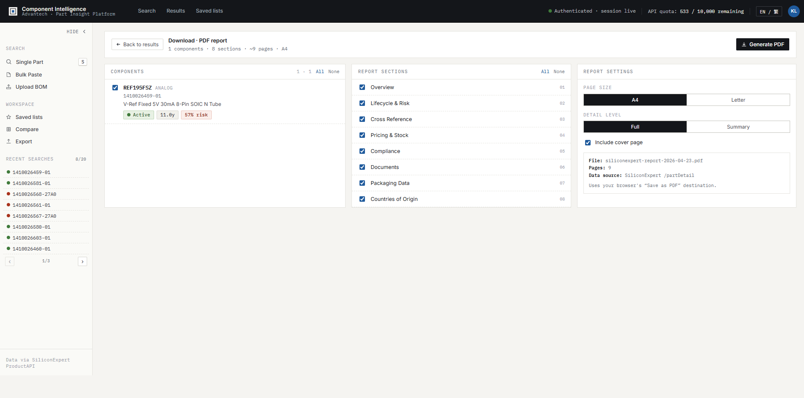

**Goal:** save a print-ready PDF dossier for one or more components.

**3-pane layout:**
- **Left — Components:** scrollable checklist. Default: pre-selects whatever you arrived with (1 part from Detail, N parts from Results). Header shows "selected / total" and All/None shortcuts.
- **Middle — Report sections:** 8 toggles matching the Detail tabs — Overview, Lifecycle & Risk, Cross Reference, Pricing & Stock, Compliance, Documents, Packaging Data, Countries of Origin. Numbered 01…08.
- **Right — Report settings:** Page size (A4 / Letter), Detail level (Full / Summary — Summary caps long lists at 3 entries), Include cover page toggle, and a live summary (filename, page count, data source).

The summary line at the top updates live: "**1 components · 8 sections · ~9 pages · A4**".

**How it prints:** clicking **Generate PDF** calls `buildReportHtml(...)` which builds a full standalone HTML document (embedded `@page` rules, IBM Plex Mono + Inter typography, footer/header on every page) and opens it in a new window. The new window auto-calls `window.print()` on `load`. Pick "Save as PDF" (or any printer) from the browser's print dialog.

**What each section renders in the PDF:**
- Cover page: generation date, component roster with MPN / manufacturer / Advantech P/N / lifecycle.
- Per-(component × section) page: kicker line (`MPN · MFR · Advantech P/N`), section title, key-value table, footer with date + section breadcrumb.

> **Fixed in this revision:** the previous build produced blank pages because an inline `display:none` was winning against the `@media print` class rule. The new window-based approach bypasses the on-screen DOM entirely. Verified via Chrome DevTools MCP: `buildReportHtml({parts:[REF195FSZ], sections:[all 8], cover:true, pageSize:"A4"})` → 8,818 bytes, 9 pages, cover present, real part data present.

### 4.2 Export — JSON payload

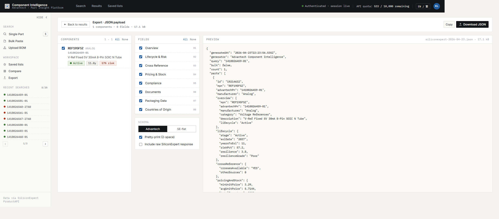

**Goal:** get machine-readable data for the same 8 sections, optionally with the raw SE response.

**3-pane layout:**
- **Left — Components:** identical checklist to Download.
- **Middle — Fields + options:**
  - Section checkboxes (same 8 as Download).
  - **Schema** selector: `Advantech` (enriched, what you see by default) vs `SE-flat` (flatter structure closer to `/partDetail`).
  - **Pretty-print (2-space)** toggle.
  - **Include raw SiliconExpert response** toggle — adds `_raw` with the exact ProductAPI payload under each part.
- **Right — Preview pane:** live-updating JSON preview with filename and byte count in the header. Syntax preserved in monospace.

**Actions (top-right):**
- **Copy** → writes to clipboard, button flashes "Copied ✓".
- **Download JSON** → saves to `siliconexpert-YYYY-MM-DD.json`.

For REF195FSZ with all 8 sections on and raw off, the payload is **17.1 kB** and includes: full datasheet revision history (14 entries from 1996–2011), 9 certifications, lifecycle history, a `counterfeit` block with 74 reports (20 shown), full packaging spec (38 fields), and the single manufacturing country (Philippines).

### 4.3 Watch — PCN & lifecycle alerts

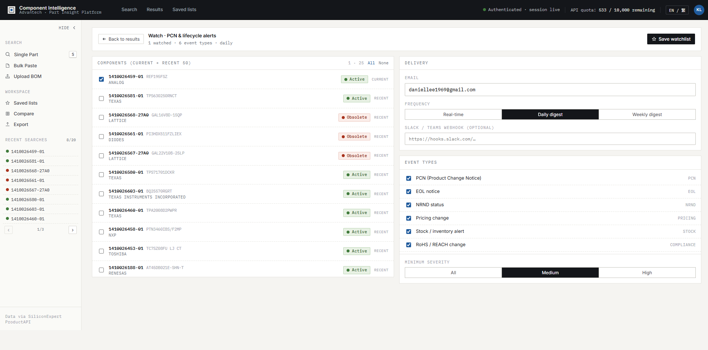

**Goal:** subscribe to Product Change Notices, EOL announcements, and other events for a set of components.

**2-column layout:**
- **Left — Components (current + recent 50):** unified picker. The current result set is tagged `CURRENT` and appears first; your last 50 recent searches (from `/api/recent?limit=50`) fill the rest, each tagged `RECENT`. Advantech P/N, MPN, manufacturer, lifecycle pill, and the tag badge are shown per row. On first load, the current-result items are pre-selected ("1 watched" for REF195FSZ).
- **Right — Configuration:**
  - **Email** — validated inline (red outline + "Invalid email format" when malformed). Pre-filled with the logged-in user's email when available.
  - **Frequency** — Real-time / Daily digest / Weekly digest.
  - **Slack / Teams webhook (optional)** — second delivery channel.
  - **Event types** — 6 toggles: PCN, EOL notice, NRND status, Pricing change, Stock / inventory alert, RoHS / REACH change. All on by default.
  - **Minimum severity** — All / Medium / High.

**Save / clear:**
- `Save watchlist` / `Update watchlist` — persists to `localStorage.ci-watchlist` with a timestamp; a green toast confirms "Watchlist saved locally".
- `Clear saved` — discards the record and unselects all parts.

**Guardrail:** the save button is disabled and a warning banner appears unless you have (a) at least one component selected, (b) a valid email, and (c) at least one event type selected.

### 4.4 Compare — side-by-side, up to 5

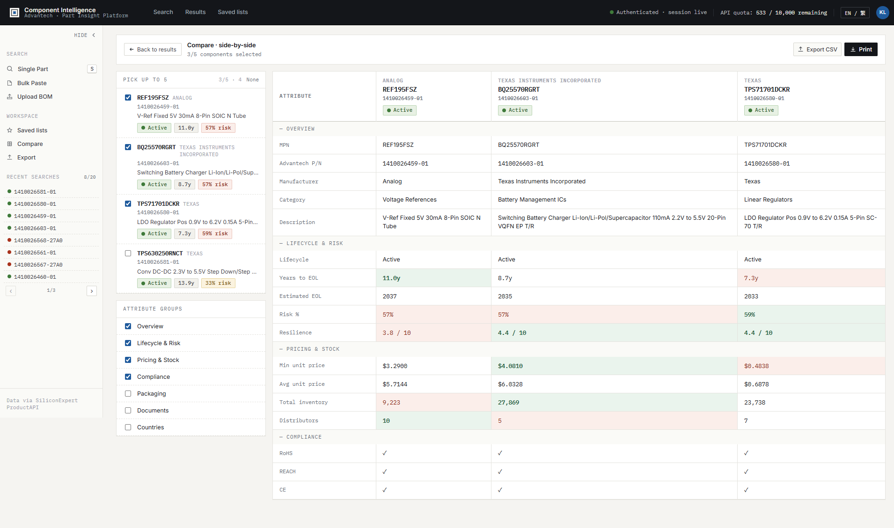

**Goal:** put up to 5 components next to each other and spot the best / worst per attribute.

**2-column layout:**
- **Left — Pick up to 5:** same component checklist as Download/Export, but with a 5-item cap. Once you hit 5, additional rows are greyed-out and un-clickable. A small counter at the top shows "N/5 · total".
  - Below it, an **Attribute groups** panel lets you toggle which groups appear in the comparison table: Overview / Lifecycle & Risk / Pricing & Stock / Compliance / Packaging / Documents / Countries.
- **Right — Comparison table:** columns are the selected components (with manufacturer, MPN, Advantech P/N, and lifecycle pill in each header), rows are the attributes grouped by — you guessed it — the groups you toggled on the left. Group headers (like `— OVERVIEW`) separate sections.

**Best / worst highlighting:**
For every numeric row (Years to EOL, Risk %, Unit price, Stock, Distributors, etc.) the table auto-scores the columns:
- Green background + bold weight = best value (higher-is-better for EOL / resilience / stock; lower-is-better for price / risk).
- Red background = worst value.
- Greys out when all values are equal.

**Export:**
- `Export CSV` → flat CSV of the full comparison table, ready for Excel.
- `Print` → same new-window pattern as Download, with landscape A4 layout tailored for a wide table.

Example from the screenshot (REF195FSZ vs BQ25570RGRT vs TPS71701DCKR):
- Years to EOL: **11.0y** (best) vs 8.7y vs 7.3y (worst).
- Min unit price: $3.29 vs $4.08 (worst) vs **$0.48** (best).
- Total inventory: 9,223 (worst) vs **27,869** (best) vs 23,738.
- Risk %: **57%** (tied-best with 57%) vs 57% vs 59% (worst).

---

## 5. Tips, troubleshooting, quotas

### 5.1 Keyboard shortcuts

- `S` — focus the search box (anywhere on the home page).
- `⏎` — submit search.

### 5.2 Language

Click `EN / 繁` in the top-right to toggle between English and 繁體中文. All four action screens, tabs, and labels are fully translated.

### 5.3 Pop-ups

**Download → Generate PDF** and **Compare → Print** open a new window. If nothing appears, the browser blocked the pop-up — click the pop-up icon in the URL bar and allow `127.0.0.1:3001`.

### 5.4 Quotas

The top-right chip shows remaining SiliconExpert API quota (e.g. `533 / 10,000 remaining`). Each `/partDetail` call burns ~1 quota. Bulk lookups are rate-limited to 50 parts per call by SE's ProductAPI contract.

### 5.5 Denodo fallback (optional)

If a PN isn't in the local Excel mapping, the backend tries Denodo's `iv_plm_allparts_latest` view. When Denodo is configured but offline, you'll see an amber banner on the Results page — **the SE path still works**, only the fallback-for-missing-Excel is disabled.

### 5.6 Backends

Two interchangeable backends expose the same `/api/*` contract and serve the same `public/index.html`:
- **Flask** (`python backend/flask_app.py`) — port 8000.
- **Next.js** (`npm run dev`) — port 3001 (used for this guide).

---

## Appendix — Recent-search components referenced in this guide

| Advantech P/N | MPN | Manufacturer | Lifecycle | YEOL | Risk |
|---|---|---|---|---|---|
| 1410026459-01 | REF195FSZ | Analog Devices | Active (Mature) | 11.0y | 57% |
| 1410026603-01 | BQ25570RGRT | Texas Instruments | Active | 8.7y | 57% |
| 1410026580-01 | TPS71701DCKR | Texas Instruments | Active | 7.3y | 59% |
| 1410026581-01 | TPS630250RNCT | Texas Instruments | Active | 13.9y | 33% |
| 1410026568-27A0 | GAL16V8D-15QP | Lattice | Obsolete | 0y | — |
| 1410026561-01 | PI3HDX511FZLIEX | Diodes | Obsolete | 0y | — |
| 1410026460-01 | TPA2008D2PWPR | Texas Instruments | Active | 7.0y | — |

All numbers above were live from SiliconExpert `/partDetail` when this guide was generated.

---

*Document generated with Chrome DevTools MCP · Screenshots live-captured from `http://127.0.0.1:3001`*
